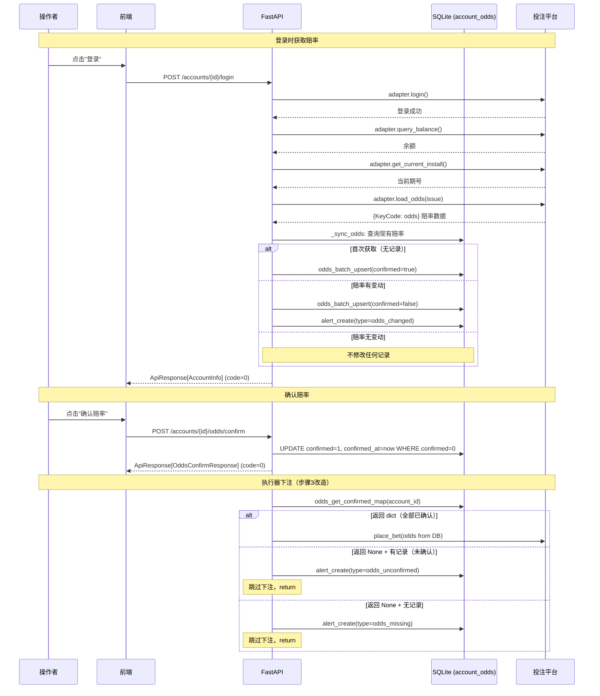
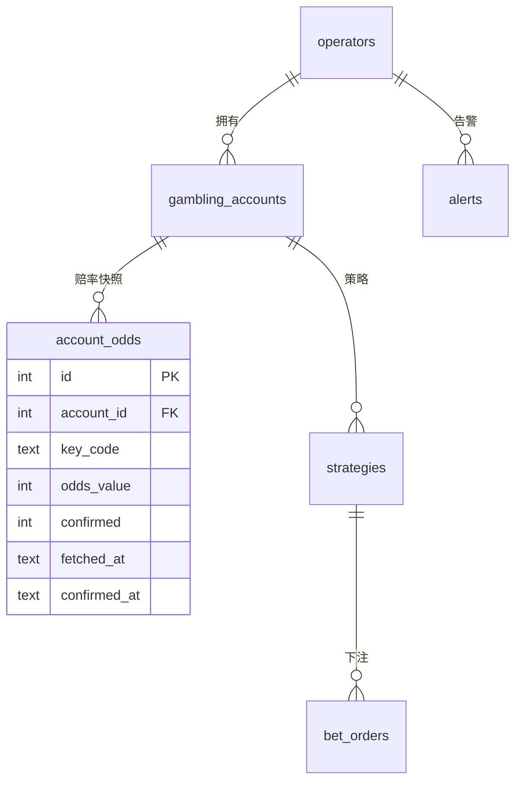

# 设计文档：账号赔率管理

## 概述

本功能将赔率管理从"每次下注实时获取"改为"登录时获取 → 本地存储 → 变动检测 → 操作者确认 → 执行器读取本地"的流程。核心变更是引入 `account_odds` 表作为赔率快照层，切断执行器对平台实时 API 的依赖，从根本上消除 `succeed=5`（赔率已改变）错误。

### 设计决策

1. **赔率存储粒度**：按 (account_id, key_code) 存储，每个账号每个玩法一条记录，使用 INSERT OR REPLACE 语义简化更新逻辑
2. **确认机制**：批量确认（一次确认该账号所有未确认赔率），而非逐条确认，降低操作者操作成本
3. **首次获取免确认**：账号首次获取赔率时自动标记为 confirmed=1，避免新绑定账号无法下注
4. **赔率获取失败不阻断登录**：赔率获取是登录的附加操作，失败时记录 warning 日志但不影响登录结果和响应格式
5. **未确认赔率阻断下注**：执行器检测到未确认赔率时跳过下注并告警，确保操作者知晓赔率变化
6. **INSERT OR REPLACE 时间戳规则**：每次 REPLACE 时显式设置 fetched_at 为 `datetime('now')`（格式 `YYYY-MM-DD HH:MM:SS`，UTC 时区）；confirmed_at 由调用方指定（confirmed=1 时传入 `datetime('now')`，confirmed=0 时传入 NULL）
7. **告警不去重**：每次登录检测到赔率变动都生成新告警，由操作者通过确认流程处理
8. **赔率值范围**：odds_value 是赔率缩放后的整数值（平台浮点赔率 × 1000 后取整），取值范围 1~999999（对应平台赔率 0.001~999.999，和值两端赔率如 HZ1=955 → 955000），与 `JNDAdapter.load_odds()` 的 `int(floor(float_val * 1000))` 一致
9. **confirmed 类型映射**：DB 层存储为 INTEGER 0/1；Pydantic Schema 和 API 响应中映射为 boolean（0→false，1→true）；前端 TypeScript 使用 boolean。CRUD 函数接受 Python bool 参数，内部转换为 0/1
10. **时间戳格式**：所有时间戳字段使用 `YYYY-MM-DD HH:MM:SS` 格式（UTC 时区），由 SQLite `datetime('now')` 生成，字符串中不包含 "UTC" 后缀，与现有系统（bet_orders.created_at、alerts.created_at 等）保持一致
11. **Proxy-Only 遵循**：本功能所有前端 API 调用通过 Vite proxy 转发（`/api/v1` 相对路径），不直连后端端口；所有平台外部请求由 PlatformAdapter 在后端完成，前端不直接访问投注平台
12. **并发安全**：赔率同步（`_sync_odds`）和确认（`odds_confirm_all`）均为 DB 写操作，依赖 SQLite WAL 模式下写操作互斥保证一致性，无需应用层加锁
13. **空赔率处理**：`load_odds(issue)` 返回空 dict 时不调用 `_sync_odds`，记录 info 日志；`odds_batch_upsert` 接收空 odds_map 时为 no-op（不执行任何 SQL）

## 架构



## 组件与接口

### 1. 数据库层 (database.py)

新增 `account_odds` 表的 DDL，追加到现有 `DDL_STATEMENTS` 列表中（第 9 张表）。

```python
# 第 9 张表：account_odds
"""
CREATE TABLE IF NOT EXISTS account_odds (
    id              INTEGER PRIMARY KEY AUTOINCREMENT,
    account_id      INTEGER NOT NULL REFERENCES gambling_accounts(id) ON DELETE CASCADE,
    key_code        TEXT NOT NULL,
    odds_value      INTEGER NOT NULL,
    confirmed       INTEGER NOT NULL DEFAULT 0,
    fetched_at      TEXT NOT NULL DEFAULT (datetime('now')),
    confirmed_at    TEXT,
    UNIQUE(account_id, key_code)
);
"""
"CREATE INDEX IF NOT EXISTS idx_account_odds_account ON account_odds(account_id, confirmed);"
```

### 2. CRUD 层 (db_ops.py)

新增赔率相关 CRUD 函数，遵循现有 db_ops.py 的模式（async 函数、db 参数、keyword-only 参数、返回 dict）：

```python
async def odds_batch_upsert(
    db: aiosqlite.Connection,
    *,
    account_id: int,
    odds_map: dict[str, int],  # key_code -> odds_value (×1000)
    confirmed: bool = False,
) -> None:
    """批量写入赔率，使用 INSERT OR REPLACE 语义。
    
    对 odds_map 中的每个 (key_code, odds_value)：
    - INSERT OR REPLACE INTO account_odds (account_id, key_code, odds_value, confirmed, fetched_at, confirmed_at)
    - fetched_at = datetime('now')  -- 格式 YYYY-MM-DD HH:MM:SS
    - confirmed: 1 if confirmed else 0
    - confirmed_at: datetime('now') if confirmed else NULL
    - 事务内批量执行，全部成功或全部回滚
    """

async def odds_list_by_account(
    db: aiosqlite.Connection,
    *,
    account_id: int,
) -> list[dict[str, Any]]:
    """获取账号所有赔率记录，按 key_code 字母序排列（ORDER BY key_code ASC）"""

async def odds_get_confirmed_map(
    db: aiosqlite.Connection,
    *,
    account_id: int,
) -> dict[str, int] | None:
    """获取已确认赔率 dict[key_code, odds_value]。
    
    逻辑：
    1. 查询该 account_id 的所有记录
    2. 如果无记录，返回 None
    3. 如果存在任何 confirmed=0 的记录，返回 None
    4. 否则返回 {key_code: odds_value} dict
    """

async def odds_confirm_all(
    db: aiosqlite.Connection,
    *,
    account_id: int,
) -> int:
    """确认该账号所有未确认赔率，返回更新行数。幂等：无 confirmed=0 则返回 0。
    
    SQL: UPDATE account_odds SET confirmed=1, confirmed_at=datetime('now')
         WHERE account_id=? AND confirmed=0
    -- datetime('now') 格式: YYYY-MM-DD HH:MM:SS
    """

async def odds_has_records(
    db: aiosqlite.Connection,
    *,
    account_id: int,
) -> bool:
    """检查账号是否有赔率记录（SELECT COUNT(*)）"""
```

### 3. Schema 层 (schemas/odds.py)

遵循 Pydantic v2 规范，使用 `model_config = ConfigDict(...)` 和 `json_schema_extra`：

```python
from pydantic import BaseModel, ConfigDict, Field

class OddsItem(BaseModel):
    """单条赔率记录，与 account_odds 表一一对应"""
    model_config = ConfigDict(
        json_schema_extra={
            "example": {
                "key_code": "DX1",
                "odds_value": 2053,
                "confirmed": True,
                "fetched_at": "2025-01-15 10:30:00",
                "confirmed_at": "2025-01-15 10:35:00"
            }
        }
    )
    key_code: str = Field(..., description="玩法编码")
    odds_value: int = Field(..., ge=1, le=99999, description="赔率值 ×1000")
    confirmed: bool = Field(..., description="是否已确认")
    fetched_at: str = Field(..., description="获取时间 UTC")
    confirmed_at: str | None = Field(None, description="确认时间 UTC，未确认时为 null")

class OddsListResponse(BaseModel):
    """赔率列表响应"""
    model_config = ConfigDict(
        json_schema_extra={
            "example": {
                "account_id": 363,
                "items": [
                    {"key_code": "DX1", "odds_value": 2053, "confirmed": True,
                     "fetched_at": "2025-01-15 10:30:00", "confirmed_at": "2025-01-15 10:35:00"}
                ],
                "has_unconfirmed": False
            }
        }
    )
    account_id: int
    items: list[OddsItem]
    has_unconfirmed: bool = Field(..., description="是否存在未确认赔率")

class OddsConfirmResponse(BaseModel):
    """赔率确认响应"""
    model_config = ConfigDict(
        json_schema_extra={
            "example": {"confirmed_count": 5}
        }
    )
    confirmed_count: int = Field(..., description="本次确认的记录数")
```

### 4. API 层 (api/odds.py)

路由文件，router 内只定义相对路径，prefix 在 main.py 统一管理：

| 端点 | 方法 | 认证 | 请求体 | 成功响应 | 错误响应 |
|------|------|------|--------|----------|----------|
| `/accounts/{account_id}/odds` | GET | JWT (get_current_operator) | - | `ApiResponse[OddsListResponse]` code=0 | code=4001 账号不存在 |
| `/accounts/{account_id}/odds/confirm` | POST | JWT (get_current_operator) | - | `ApiResponse[OddsConfirmResponse]` code=0 | code=4001 账号不存在 |

路由注册在 `main.py`：
```python
from app.api.odds import router as odds_router
app.include_router(odds_router, prefix="/api/v1", tags=["odds"])
```

两个端点都需要：
1. 通过 `get_current_operator` 获取当前操作者
2. 通过 `account_get_by_id(db, account_id=account_id, operator_id=operator["id"])` 验证账号归属
3. 账号不存在或不属于当前操作者时返回 `BizError(4001, "账号不存在", status_code=404)`

GET /odds 端点额外逻辑：
- 调用 `odds_list_by_account` 获取记录（已按 key_code 字母序排列）
- 构建 OddsListResponse，has_unconfirmed = any(not item.confirmed for item in items)

POST /odds/confirm 端点额外逻辑：
- 调用 `odds_confirm_all` 获取更新行数
- 返回 OddsConfirmResponse(confirmed_count=更新行数)，幂等调用时为 0

### 5. 登录流程改造 (api/accounts.py)

在 `manual_login` 端点中，查询余额之后、`adapter.close()` 之前，增加赔率获取逻辑。登录响应保持现有 `ApiResponse[AccountInfo]` 格式不变（code=0, HTTP 200），赔率获取结果不影响响应结构：

```python
# 在 balance_info 查询之后，finally: adapter.close() 之前
# 登录成功后必须调用 get_current_install() + load_odds(issue)
try:
    install = await adapter.get_current_install()
    new_odds = await adapter.load_odds(install.issue)
    if new_odds:  # 非空才处理
        await _sync_odds(db, account_id, operator["id"], new_odds)
except Exception as e:
    # 记录 warning 日志（含 account_id + 异常信息），不阻断登录
    logger.warning("赔率获取失败 account_id=%d: %s", account_id, e)
```

`_sync_odds` 函数（定义在 accounts.py 或独立为 odds_sync.py）：

```python
async def _sync_odds(
    db: aiosqlite.Connection,
    account_id: int,
    operator_id: int,
    new_odds: dict[str, int],
) -> None:
    """赔率同步逻辑：比较 + 写入 + 告警"""
    existing = await odds_list_by_account(db, account_id=account_id)
    
    if not existing:
        # 首次获取：confirmed=true，不告警
        await odds_batch_upsert(db, account_id=account_id, odds_map=new_odds, confirmed=True)
        return
    
    # 构建现有赔率 map
    old_map = {row["key_code"]: row["odds_value"] for row in existing}
    
    # 比较差异
    if old_map == new_odds:
        # 完全相同：不修改，不告警
        return
    
    # 有变动：全量写入 confirmed=false + 告警
    await odds_batch_upsert(db, account_id=account_id, odds_map=new_odds, confirmed=False)
    
    # 构建变动详情（格式：KeyCode: old_value → new_value，每行一个变动项）
    changes = []
    all_keys = set(old_map.keys()) | set(new_odds.keys())
    for key in sorted(all_keys):
        old_val = old_map.get(key)
        new_val = new_odds.get(key)
        if old_val != new_val:
            old_str = str(old_val) if old_val is not None else "无"
            new_str = str(new_val) if new_val is not None else "已删除"
            changes.append(f"{key}: {old_str} → {new_str}")
    
    detail = "\n".join(changes)
    await alert_create(
        db,
        operator_id=operator_id,
        type="odds_changed",
        level="warning",
        title=f"赔率变动（账号 {account_id}）",
        detail=detail,
    )
```

### 6. 执行器改造 (engine/executor.py)

修改 `_execute_inner` 步骤 3（原代码：`odds = await self.adapter.load_odds(install.issue)`）。登录响应格式不受影响，执行器仅读取本地数据：

```python
# 步骤 3：从本地数据库读取已确认赔率（替代原 adapter.load_odds）
from app.models.db_ops import odds_get_confirmed_map, odds_has_records

odds = await odds_get_confirmed_map(self.db, account_id=self.account_id)

if odds is None:
    has_records = await odds_has_records(self.db, account_id=self.account_id)
    if not has_records:
        # 无记录：alert_type="odds_missing", level="warning", title="请先登录获取赔率"
        await self.alert_service.send(
            operator_id=self.operator_id,
            alert_type="odds_missing",
            title="请先登录获取赔率",
            detail="该账号尚未获取赔率数据，请先手动登录",
            account_id=self.account_id,
        )
    else:
        # 有未确认记录：alert_type="odds_unconfirmed", level="warning", title="请先确认赔率更新"
        await self.alert_service.send(
            operator_id=self.operator_id,
            alert_type="odds_unconfirmed",
            title="请先确认赔率更新",
            detail="该账号存在未确认的赔率变动，请先确认后再下注",
            account_id=self.account_id,
        )
    return  # 跳过本次所有下注信号

# odds 现在是 dict[str, int]，格式与原 load_odds 返回一致（KeyCode → 赔率缩放值）
# 后续步骤 4~6 无需修改
```

### 7. 前端组件

#### TypeScript 类型 (types/api/odds.ts)

与后端 Pydantic schema 一一对应：

```typescript
/** 单条赔率记录，对应 backend/app/schemas/odds.py OddsItem */
export interface OddsItem {
  key_code: string;
  odds_value: number;    // INTEGER ×1000
  confirmed: boolean;
  fetched_at: string;
  confirmed_at: string | null;
}

/** 赔率列表响应，对应 OddsListResponse */
export interface OddsListResponse {
  account_id: number;
  items: OddsItem[];
  has_unconfirmed: boolean;
}

/** 赔率确认响应，对应 OddsConfirmResponse */
export interface OddsConfirmResponse {
  confirmed_count: number;
}
```

#### API 封装 (api/odds.ts)

通过统一请求层 `@/api/request`：

```typescript
import { request } from '@/api/request';
import type { OddsListResponse, OddsConfirmResponse } from '@/types/api/odds';

export async function getAccountOdds(accountId: number) {
  return request<OddsListResponse>(`/accounts/${accountId}/odds`);
}

export async function confirmAccountOdds(accountId: number) {
  return request<OddsConfirmResponse>(`/accounts/${accountId}/odds/confirm`, {
    method: 'POST',
  });
}
```

#### 账号卡片改造 (pages/operator/Accounts.tsx)

在 AccountCard 中增加赔率状态显示：
- 登录后调用 `getAccountOdds` 获取赔率状态
- 显示"赔率状态"标签：已确认（绿色 badge）/ 待确认（橙色 badge）/ 未获取（灰色 badge）
- 待确认状态下显示"确认赔率"按钮
- 点击确认后调用 `confirmAccountOdds`，成功后刷新赔率状态
- 错误处理：catch ApiError 并 alert(err.message)

## 数据模型

### account_odds 表

| 字段 | 类型 | 约束 | 说明 |
|------|------|------|------|
| id | INTEGER | PRIMARY KEY AUTOINCREMENT | 主键 |
| account_id | INTEGER | NOT NULL, FK → gambling_accounts(id) ON DELETE CASCADE | 关联账号 |
| key_code | TEXT | NOT NULL | 玩法编码（如 DX1、HZ15） |
| odds_value | INTEGER | NOT NULL | 赔率值 ×1000（如 2053 表示 2.053），范围 1~99999 |
| confirmed | INTEGER | NOT NULL DEFAULT 0 | 0=未确认, 1=已确认 |
| fetched_at | TEXT | NOT NULL DEFAULT datetime('now') | 获取时间 UTC |
| confirmed_at | TEXT | 可空 | 确认时间 UTC，未确认时为 NULL |

唯一约束：`UNIQUE(account_id, key_code)`
索引：`idx_account_odds_account ON account_odds(account_id, confirmed)`

### 赔率值转换规则

| 阶段 | 格式 | 示例 |
|------|------|------|
| 平台 API 返回 | float | 2.053 |
| JNDAdapter.load_odds() 转换 | int(floor(float * 1000)) | 2053 |
| account_odds 表存储 | INTEGER | 2053 |
| API 响应 (OddsItem.odds_value) | integer | 2053 |
| 前端 TypeScript (OddsItem.odds_value) | number | 2053 |
| 前端显示 | odds_value / 1000 | 2.053 |

### 与现有表的关系



## 正确性属性

*属性（Property）是系统在所有有效执行中都应保持为真的特征或行为——本质上是关于系统应该做什么的形式化陈述。属性是人类可读规格说明与机器可验证正确性保证之间的桥梁。*

### Property 1: UPSERT 幂等性

*For any* account_id 和 key_code 组合，以及任意序列的 odds_value 写入操作（通过 `odds_batch_upsert`），Account_Odds_Table 中该 (account_id, key_code) 组合始终只有一条记录，且 odds_value 等于最后一次写入的值。

**Validates: Requirements 1.1, 1.2, 1.3**

### Property 2: 批量写入完整性

*For any* 非空的 odds_map（dict[str, int]，key_code 非空、odds_value 在 1~99999 范围内），调用 `odds_batch_upsert(confirmed=False)` 后，Account_Odds_Table 中该 account_id 的记录数量等于 odds_map 的键数量，且每条记录的 confirmed=0、fetched_at 为非空时间戳、confirmed_at 为 NULL。

**Validates: Requirements 2.2, 2.4（非首次场景）**

### Property 3: 赔率变动检测与告警

*For any* 两组不同的赔率 map（old_odds 和 new_odds，至少有一个 key_code 的 odds_value 不同），先以 confirmed=true 写入 old_odds，再调用 `_sync_odds` 传入 new_odds，系统应：(a) 将所有赔率更新为 confirmed=false，(b) 在 alerts 表中生成一条 type="odds_changed" 的告警，(c) 告警 detail 中包含所有变动的 key_code。

**Validates: Requirements 3.1, 3.2, 3.3（变动场景）**

### Property 4: 相同赔率幂等性

*For any* odds_map，先以 confirmed=true 写入并确认所有赔率，再用完全相同的 odds_map 调用 `_sync_odds`，Account_Odds_Table 中所有记录的 confirmed 状态应保持为 1，且 alerts 表中不产生新的 type="odds_changed" 告警。

**Validates: Requirements 3.4（无变动场景）**

### Property 5: 首次获取自动确认

*For any* 非空的 odds_map 和一个在 Account_Odds_Table 中无记录的 account_id，调用 `_sync_odds` 后，所有写入的记录 confirmed=1、confirmed_at 为非空时间戳，且 alerts 表中不产生 type="odds_changed" 告警。

**Validates: Requirements 3.1（首次场景）**

### Property 6: 批量确认

*For any* 包含 N 条 confirmed=0 记录的账号（N >= 1），调用 `odds_confirm_all` 后，该账号所有记录的 confirmed=1，且 confirmed_at 为非空时间戳。返回值等于 N。

**Validates: Requirements 4.1**

### Property 7: 未确认赔率阻断下注

*For any* 包含至少一条 confirmed=0 赔率记录的 account_id，调用 `odds_get_confirmed_map` 应返回 None。

**Validates: Requirements 5.2**

### Property 8: 赔率读取往返一致性

*For any* 有效的 odds_map（dict[str, int]，所有 key_code 非空、odds_value 在 1~99999 范围内），以 confirmed=true 写入 Account_Odds_Table 后，调用 `odds_get_confirmed_map` 返回的 dict 应与原始 odds_map 完全相等（键集合相同、每个键的值相同）。

**Validates: Requirements 5.4**

### Property 9: OddsItem 序列化往返

*For any* 有效的 OddsItem 实例（key_code 非空、odds_value 在 1~99999、confirmed 为布尔值、fetched_at 为 `YYYY-MM-DD HH:MM:SS` 格式字符串），通过 `model_dump_json()` 序列化后再通过 `OddsItem.model_validate_json()` 反序列化，所有字段值应与原始实例完全相等。

**Validates: Requirements 6.1, 6.2**

### Property 10: 告警 detail 包含所有变动 KeyCode

*For any* 两组不同的赔率 map（old_odds 和 new_odds），调用 `_sync_odds` 后生成的 odds_changed 告警的 detail 字段中，每个发生变动的 KeyCode（值不同、新增、删除）都应出现在 detail 文本中，且格式为 `KeyCode: old_value → new_value`（新增为 `KeyCode: 无 → new_value`，删除为 `KeyCode: old_value → 已删除`）。

**Validates: Requirements 3.3**

### Property 11: 执行器根据赔率状态正确触发告警

*For any* account_id，当 `odds_get_confirmed_map` 返回 None 时：若 `odds_has_records` 返回 True，则 AlertService 应收到 alert_type="odds_unconfirmed" 的告警；若 `odds_has_records` 返回 False，则 AlertService 应收到 alert_type="odds_missing" 的告警。两种情况下执行器均应跳过下注（return）。

**Validates: Requirements 5.2, 5.3**

## 错误处理

| 场景 | 处理方式 | 响应/告警 |
|------|----------|-----------|
| 登录时 `get_current_install()` 失败 | 记录 warning 日志，不阻断登录 | 登录响应不变（code=0） |
| 登录时 `load_odds(issue)` 失败 | 记录 warning 日志，不阻断登录 | 登录响应不变（code=0） |
| 登录时 `load_odds(issue)` 返回空 dict | 记录 info 日志，不调用 `_sync_odds` | 登录响应不变（code=0） |
| 登录时 `_sync_odds` 写入 DB 失败 | 记录 error 日志，不阻断登录 | 登录响应不变（code=0） |
| `odds_batch_upsert` 接收空 odds_map | no-op，不执行 SQL | 无 |
| GET /odds 账号不存在或不属于当前操作者 | 返回 BizError | code=4001, HTTP 404, message="账号不存在" |
| POST /odds/confirm 账号不存在或不属于当前操作者 | 返回 BizError | code=4001, HTTP 404, message="账号不存在" |
| GET /odds 未认证 | FastAPI 依赖注入拒绝 | HTTP 401 |
| POST /odds/confirm 未认证 | FastAPI 依赖注入拒绝 | HTTP 401 |
| OddsItem schema 校验失败（odds_value 超范围等） | Pydantic ValidationError | HTTP 422（FastAPI 自动处理） |
| 执行器：账号无赔率记录 | 跳过下注，return | alert_type="odds_missing" |
| 执行器：存在未确认赔率 | 跳过下注，return | alert_type="odds_unconfirmed" |
| 确认与同步并发 | SQLite WAL 写互斥，按先后顺序执行 | 无数据不一致风险 |

### 告警类型扩展

在现有 AlertService 基础上新增三种告警类型：

| alert_type | level | 触发场景 | 去重规则 |
|------------|-------|----------|----------|
| `odds_changed` | warning | 登录时检测到赔率变动 | 不去重，每次变动都生成 |
| `odds_missing` | warning | 执行器发现账号无赔率记录 | 不去重（执行器每次执行都可能触发） |
| `odds_unconfirmed` | warning | 执行器发现未确认赔率 | 不去重（执行器每次执行都可能触发） |

## 测试策略

### 属性测试（Property-Based Testing）

使用 **hypothesis**（后端 Python）进行属性测试。

每个属性测试配置：
- 最少 100 次迭代（`@settings(max_examples=100)`）
- 每个测试标注对应的设计属性编号
- 使用内存数据库（`:memory:`）避免文件 IO

后端属性测试文件：`backend/tests/test_odds_properties.py`

| 属性 | 测试标签 | 生成器 |
|------|----------|--------|
| P1: UPSERT 幂等性 | Feature: account-odds-management, Property 1: UPSERT 幂等性 | 随机 key_code（st.text 1~10 字符）+ odds_value 序列（st.lists of st.integers 1~99999） |
| P2: 批量写入完整性 | Feature: account-odds-management, Property 2: 批量写入完整性 | 随机 odds_map（st.dictionaries, keys=key_code, values=1~99999, min_size=1, max_size=50） |
| P3: 赔率变动检测 | Feature: account-odds-management, Property 3: 赔率变动检测与告警 | 两组不同的随机 odds_map（通过 assume 确保至少一个值不同） |
| P4: 相同赔率幂等性 | Feature: account-odds-management, Property 4: 相同赔率幂等性 | 随机 odds_map |
| P5: 首次获取自动确认 | Feature: account-odds-management, Property 5: 首次获取自动确认 | 随机 odds_map |
| P6: 批量确认 | Feature: account-odds-management, Property 6: 批量确认 | 随机 odds_map（1~50 条） |
| P7: 未确认阻断下注 | Feature: account-odds-management, Property 7: 未确认赔率阻断下注 | 随机 odds_map（含至少一条 confirmed=false） |
| P8: 往返一致性 | Feature: account-odds-management, Property 8: 赔率读取往返一致性 | 随机 odds_map |
| P9: 序列化往返 | Feature: account-odds-management, Property 9: OddsItem 序列化往返 | 随机 OddsItem（key_code=st.text, odds_value=1~99999, confirmed=st.booleans, fetched_at=时间戳字符串） |
| P10: 告警 detail 变动格式 | Feature: account-odds-management, Property 10: 告警 detail 包含所有变动 KeyCode | 两组不同的随机 odds_map（通过 assume 确保差异） |
| P11: 执行器告警触发 | Feature: account-odds-management, Property 11: 执行器根据赔率状态正确触发告警 | 随机 odds_map + confirmed 状态组合 |

### 单元测试

后端单元测试：`backend/tests/test_odds.py`
- 赔率 CRUD 基本操作（upsert、list、confirm、has_records）
- `_sync_odds` 逻辑三种场景（首次/变动/无变动）
- 执行器改造后的赔率读取逻辑（已确认/未确认/无记录）
- API 端点（GET /odds 成功、POST /odds/confirm 成功、账号不存在 4001）
- 边界条件：空 odds_map、单条赔率、大量赔率（80+ KeyCode）

前端单元测试：`frontend/tests/unit/odds-api.test.ts`
- API 封装函数调用路径正确性
- 错误处理（ApiError 捕获）
