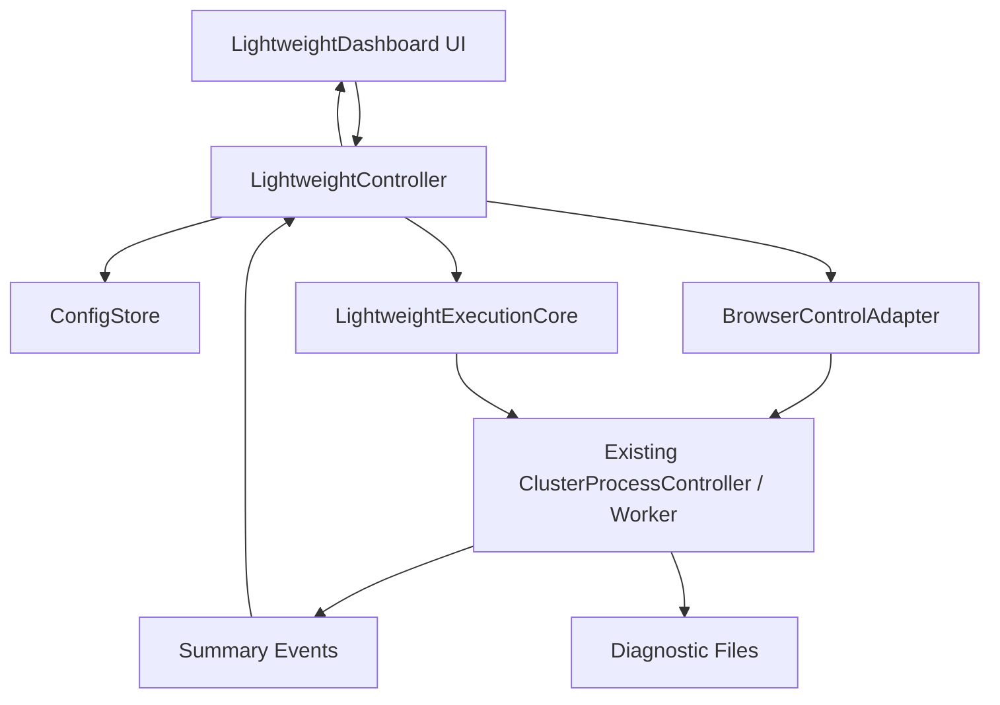

# 轻量对冲 UI 设计文档

日期：2026-06-24

## 目标

构建一个独立的轻量桌面 UI，用于 4 账号庄闲对冲。新版 UI 负责配置、展示、按钮控制和结果摘要，不承载高频采集、不承载真实点击细节、不替代后端状态机。

## 设计原则

1. 新 UI 独立于旧 `MainDashboard`，避免继承旧 UI 的重刷新路径。
2. 通过服务层或适配器复用旧 UI 已验证的能力，而不是复制旧 UI 的界面和轮询逻辑。
3. 所有高风险链路只做包装和调用，不改内部算法。
4. UI 只展示摘要状态，详细诊断写文件。
5. 普通界面和高级调试分离。

## 建议模块

### 新增模块

建议新增：

- `bet_desktop/ui/lightweight_dashboard.py`
- `bet_desktop/ui/lightweight_models.py`
- `bet_desktop/ui/lightweight_config_store.py`
- `bet_desktop/ui/lightweight_controller.py`
- `bet_desktop/ui/run_lightweight_dashboard.py`

说明：
- `lightweight_dashboard.py`：只负责 PySide 界面。
- `lightweight_models.py`：UI 数据结构。
- `lightweight_config_store.py`：读取/保存平台配置。
- `lightweight_controller.py`：连接 UI 与旧能力/轻量核心。
- `run_lightweight_dashboard.py`：独立入口。

### 可复用模块

可读取或调用，但不得大改：

- `bet_desktop/ui/main_dashboard.py` 中平台配置结构和已验证按钮命令语义。
- `bet_desktop/backend/cluster_process_worker.py` 中浏览器启动、接管、进房、真实执行函数。
- `scripts/live_interval_acceptance_probe.py` 中 4 账号轻量测试脚本的计划拆分、统一发号、并行执行思想。
- `bet_desktop/core/decomposition.py` 的筹码拆分。

## 架构



## 核心边界

### UI 层

职责：
- 展示平台配置摘要。
- 展示 4 账号状态摘要。
- 提供按钮：启动、暂停、急停、批量动作、主号切换。
- 展示执行记录和摘要日志。
- 高级设置默认折叠。

禁止：
- 不直接访问 Playwright page。
- 不直接执行点击。
- 不直接运行 canvas 探针或前端对象扫描。
- 不对每个原始状态事件立即刷新 UI。

### Controller 层

职责：
- 把 UI 操作转换为命令。
- 做按钮防重复提交。
- 聚合后端事件为摘要。
- 对 UI 更新节流。
- 管理轻量核心的生命周期。

禁止：
- 不改写状态机判断。
- 不在 UI 线程做耗时操作。

### Adapter 层

职责：
- 复用旧 UI/worker 的平台启动、填登录、接管、进房能力。
- 对外提供简洁方法。
- 不依赖旧 UI widget；adapter 只能依赖后端、worker 或命令级能力接口。

建议接口：

```python
class BrowserControlAdapter:
    def start_accounts(self, account_ids: list[str]) -> None: ...
    def fill_login(self, account_ids: list[str]) -> None: ...
    def handoff_to_headless(self, account_ids: list[str]) -> None: ...
    def enter_room(self, account_ids: list[str], room_index: int) -> None: ...
    def release_headless(self, account_ids: list[str]) -> None: ...
    def stop_accounts(self, account_ids: list[str]) -> None: ...
```

### LightweightExecutionCore

职责：
- 管理当前主号和副号列表。
- 在发号前并行确认同房、同局、可下注、倒计时。
- 生成 4 账号对冲计划。
- 调用现有真实执行能力并聚合结果。

建议接口：

```python
class LightweightExecutionCore:
    def set_main_account(self, account_id: str) -> None: ...
    def configure(self, config: ExecutionConfig) -> None: ...
    async def wait_and_execute_next_round(self) -> RoundResult: ...
    async def execute_test_round(self) -> RoundResult: ...
```

## Data Model

### PlatformSlot

```python
@dataclass
class PlatformSlot:
    account_id: str
    display_name: str
    login_url: str
    target_url: str
    target_room: str
    proxy_host: str
    proxy_port: str
    proxy_username: str
    proxy_password: str
    proxy_expire_at: str
    account_username: str
    account_password: str
```

### AccountStatusSummary

```python
@dataclass
class AccountStatusSummary:
    account_id: str
    display_name: str
    mode: Literal["headed", "headless", "stopped", "unknown"]
    role: Literal["main", "sub"]
    room_label: str
    round_id: str
    countdown: int | None
    betting_open: bool
    balance: Decimal | None
    pending_amount: Decimal | None
    state_label: str
    updated_at_ms: int
```

### ExecutionConfig

```python
@dataclass
class ExecutionConfig:
    accounts: tuple[str, ...]
    main_account: str
    headless_accounts: tuple[str, ...]
    amount_min: int
    amount_max: int
    click_interval_ms: int
    min_countdown: int
    confirm_ms: int
    room_index: int
```

### RoundResult

```python
@dataclass
class RoundResult:
    round_id: str
    room_label: str
    send_countdowns: dict[str, int]
    click_interval_ms: int
    legs: list[BetLegResult]
    max_elapsed_ms: int
    missing_total: Decimal
    status: Literal["complete", "partial", "skipped", "failed"]
    reason: str
```

## Configuration

配置文件继续兼容旧结构：

- `dist/BetDesktop/bet_desktop/artifacts/platform_proxy_profiles.json`

新增字段允许向后兼容：

- `proxy_expire_at`
- `lightweight_ui`
- `lightweight_ui.main_account`
- `lightweight_ui.amount_min`
- `lightweight_ui.amount_max`
- `lightweight_ui.click_interval_ms`
- `lightweight_ui.min_countdown`
- `lightweight_ui.confirm_ms`

写入要求：
- 保留旧字段。
- 未识别字段不得删除。
- 保存失败必须提示用户。

## Interfaces

### UI 事件输入

- `start_clicked`
- `pause_clicked`
- `stop_clicked`
- `main_account_changed`
- `batch_start_clicked`
- `batch_fill_login_clicked`
- `batch_handoff_clicked`
- `batch_enter_room_clicked`
- `batch_release_clicked`
- `batch_stop_clicked`
- `test_one_round_clicked`
- `test_ten_rounds_clicked`

### UI 状态输出

- `platform_summary_updated`
- `account_status_updated`
- `gate_status_updated`
- `round_plan_updated`
- `round_result_appended`
- `operator_log_appended`
- `error_banner_updated`

### 后端摘要事件

Controller 对后端事件做摘要化，只传给 UI：

- 账号启动/停止。
- 登录填写结果。
- 接管开始/成功/失败。
- 进房成功/失败。
- 发号门槛通过/阻断。
- 每轮执行最终结果。
- 资源告警摘要。

不传给 UI 主日志：

- 每个原始 WebSocket 包。
- 每个 canvas 文本探针。
- 每个坐标采样。
- 每个筹码点击细节。
- 高频 shadow 状态。

## Error Handling

### 普通错误

1. 配置缺失：显示字段缺失，不启动该平台。
2. 代理缺失：允许保存，但启动前阻断并提示。
3. 登录失败：显示该账号登录失败，详细原因写日志。
4. 接管失败：显示账号、阶段、简短原因。
5. 进房失败：显示账号、房间、简短原因。

### 发号阻断

以下任一情况必须阻断：

- 账号不在同一房间。
- 局号不一致。
- 倒计时缺失。
- 倒计时低于门槛。
- 状态不可下注。
- 主号或副号缺失。
- 任一参与账号未准备好。

### 真实执行异常

UI 不显示“成功”，直到 worker 返回最终结果。

状态语义：
- `complete`：全部账号完整执行。
- `partial`：存在缺口。
- `skipped`：发号前阻断或预检失败。
- `failed`：执行异常。

## Test Strategy

### 阶段 1：UI 壳

测试：
- 新 UI 可启动。
- 三个页面可切换。
- 主号切换联动本轮计划。
- 高级设置默认折叠。

### 阶段 2：配置

测试：
- 读取旧配置。
- 保存新字段不破坏旧字段。
- 缺失字段显示为空但不崩溃。
- 代理到期时间可显示。

### 阶段 3：启动登录

测试：
- 单账号启动命令生成正确。
- 批量启动命令生成正确。
- 填登录命令生成正确。
- UI 不高频刷新日志。

### 阶段 4：接管进房

测试：
- 主号不在无头接管列表中。
- 副号接管列表随主号切换变化。
- 批量进房命令覆盖 4 账号。
- 接管失败只显示摘要。

### 阶段 5：轻量执行

测试：
- 4 账号计划拆分正确。
- 同房/同局/倒计时门槛阻断正确。
- 执行结果聚合正确。
- 缺口显示正确。

### 阶段 6：日志和资源

测试：
- 主日志不出现逐筹码细节。
- 主日志行数上限生效。
- 摘要刷新节流生效。
- 详细诊断写文件。

## 风险与保护

### 高风险点

1. 接管大厅：可能影响无头窗口尺寸、profile、H5 状态恢复。
2. 进房：可能影响房间识别和按钮坐标。
3. 真实执行：可能影响坐标点击、筹码选择、确认结果。
4. 状态采集：可能影响倒计时、局号、余额、房间一致性。

### 保护策略

1. 阶段 1-3 只做新 UI、配置和命令包装。
2. 阶段 4 前必须审核具体变更 diff。
3. 阶段 5 前必须审核轻量核心接入点。
4. 不修改后端核心算法，只通过 adapter 调用。
5. 所有高风险改动必须能单独回滚。

## 审核门禁

审核 agent 必须确认：

1. 文档是否覆盖 1-6 阶段。
2. 是否明确禁止搬旧 UI 高频逻辑。
3. 是否保护了状态、倒计时、局号、余额、房间、限红、坐标链路。
4. 是否将调试功能默认折叠。
5. 是否避免 UI 线程直接操作浏览器。
6. 是否有可测试任务拆分。

审核不通过不得开发。
